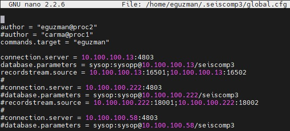
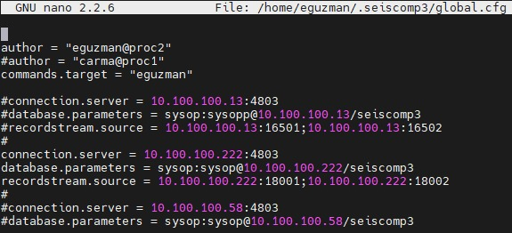
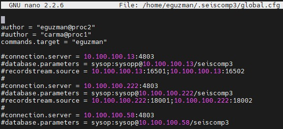
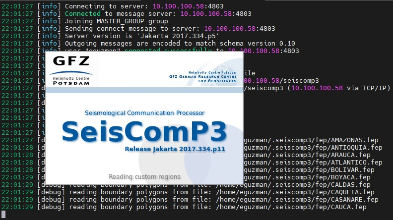

# Routine global_set

## Description
This routine modifies the .seiscomp3/global.cfg file for a specific server (13, 50, 58, 222, 232  - *default*).

## Running the *global_set.py*

### Input parameters

The *global_set.py* needs only one parameter: 13, 50, 58, 222, 232 or *default*, depending on the corresponding server (e.g. user@10.100.100.13 for the input parameter 13).

### Execution

For any server of the list [13, 50, 58, 222, 232, *default*] (where 232 is the same as *default*):

```
python global_set.py server
```

#### Some results
For server 13:



For server 222:



For server 232 or *default*:



For server 58: This execution has the additional case that It will run the command *scolv -u user --debug*.




#

>Emmanuel Guzmán Vitola

>>eguzmanv@sgc.gov.co
>>emguzmanvi@unal.edu.co
